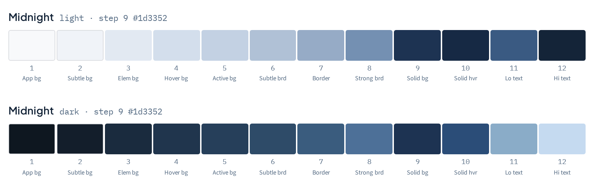
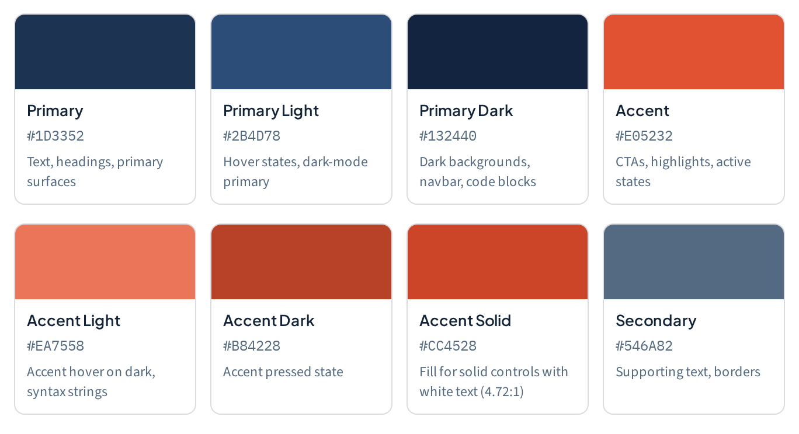
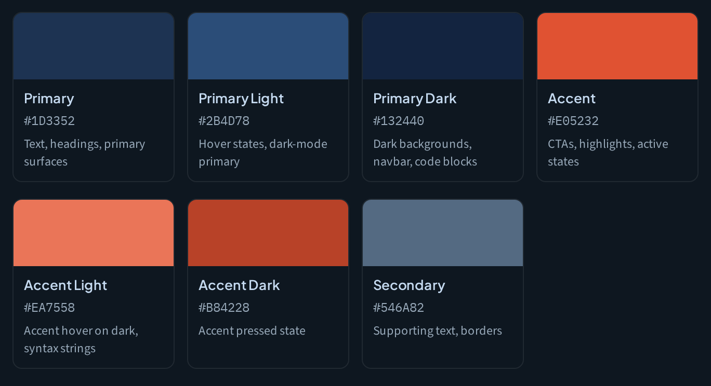
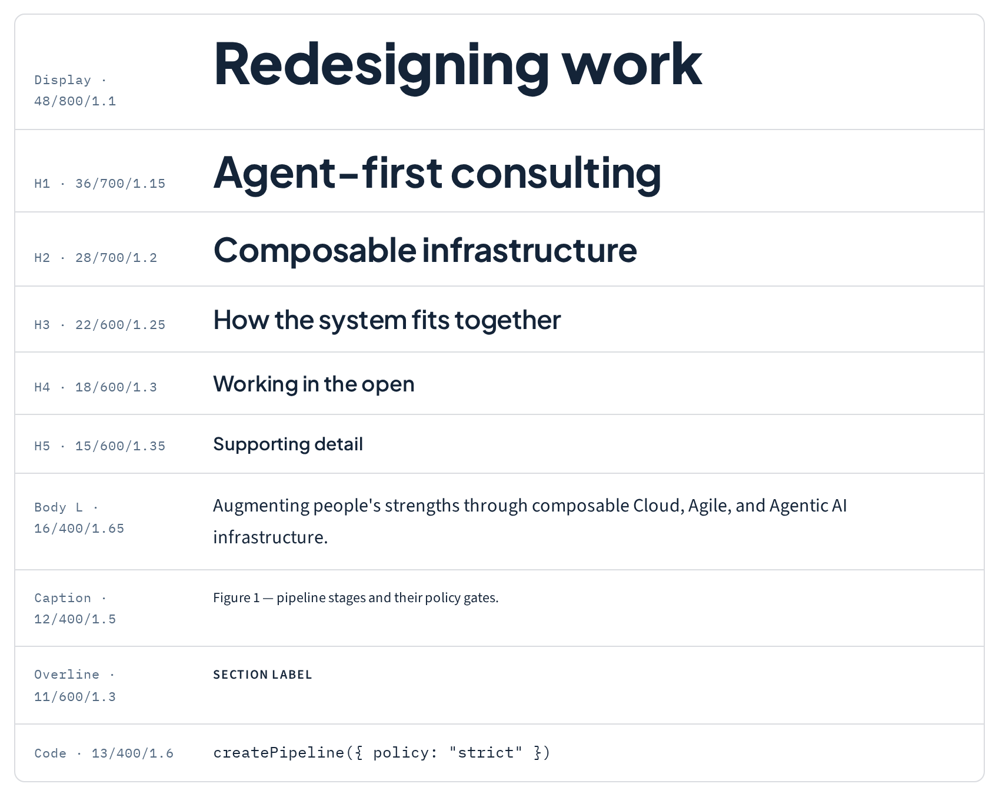
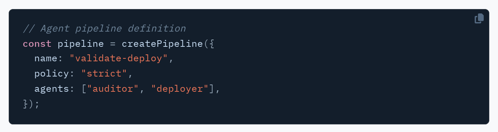
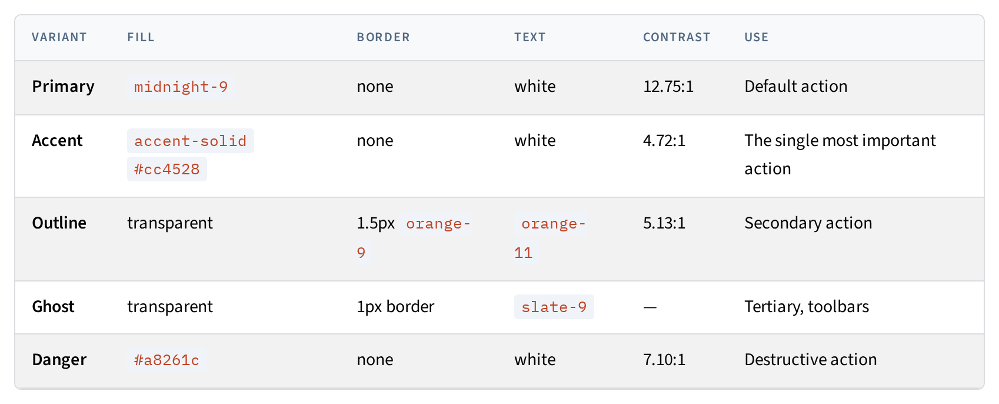

<div align="center">
  
  <h1>projectious.work — Brand &amp; Design System</h1>
  <p>
    <strong><a href="https://projectious-work.github.io/brand/">projectious-work.github.io/brand</a></strong>
  </p>
  <p>
    Colour, typography, logo, and interface patterns — with the usage terms that go with them.
  </p>
</div>

---

This repository holds the complete brand system for projectious.work: the design
documentation, the logo in every delivered format, machine-readable design
tokens, and document templates. The published site at
**[projectious-work.github.io/brand](https://projectious-work.github.io/brand/)**
is generated from this repository and is **built with the system it documents** —
the colour scales rendering those pages are the scales the pages describe.

**Status:** Active — maintained · **Release:** v3.0.0

## What's inside

### Three scales, defined step roles

The palette is three 12-step Radix-convention ramps — midnight, orange, slate —
each in a light and dark variant. Every step carries a *role*, so a border step
never gets pressed into service as text.



### A named entry point for each colour

Seven aliases sit on top of the scales for the values most projects reach for
first.



Both modes are designed together, not derived from one another:



### Three typefaces, three jobs

Plus Jakarta Sans for headings, Source Sans 3 for body, IBM Plex Mono for code —
all SIL OFL 1.1, on a fixed ramp. Each row below is set in the values it
documents.



### Code surfaces stay dark in both modes

…because a code block that flips with the theme forces the syntax palette to be
designed twice. Every token in the theme carries a measured contrast ratio.



### Components with normative measurements

Where a component appears in the docs, its numbers are binding — a 40px input is
40px.



## Documentation

Full-text search is at
**[/search/](https://projectious-work.github.io/brand/search/)** — live
filtering, term highlighting, shareable `?q=` links, and no external search
service. The release dropdown in the top bar switches between versions.

| Section | Covers |
|---|---|
| [Foundations](https://projectious-work.github.io/brand/docs/foundations/) | Colour, typography, spacing, shape, motion |
| [Logo](https://projectious-work.github.io/brand/docs/logo/) | Lockups, clear space, minimum sizes, file formats |
| [Interface](https://projectious-work.github.io/brand/docs/interface/) | Components, code, dark mode, icons, forms |
| [Media](https://projectious-work.github.io/brand/docs/media/) | Motion, audio, video, photography, presentations |
| [Collateral](https://projectious-work.github.io/brand/docs/collateral/) | Business card, email signature, social and OG |
| [Governance](https://projectious-work.github.io/brand/docs/governance/) | Licensing, trademark, legal assessment, provenance |
| [Tokens](https://projectious-work.github.io/brand/docs/tokens/) | CSS, JSON, and Tailwind exports |

## Repository layout

```
src/                Normative brand contract and Hugo site
├── hugo.yaml       Site and release configuration
├── content/        Authoritative human-readable documentation
├── assets/scss/    Site-owned, data-driven design-system specimens
├── layouts/        Layouts and the specimen shortcodes
├── data/brand.yaml Authoritative structured values
├── static/         Public assets and generated token downloads
└── go.mod          Pinned projectious.work Hugo theme release

input/              Designer-supplied upstream reference material
scripts/            Local generation, verification, release, and deploy tools
```

`src/data/brand.yaml` and `src/content/docs/` are the local sources of truth.
Public downloads are generated from them. `input/` is reference material for
reconciliation and is not a second runtime authority.

Build output goes to `public/` at the repository root, not inside `src/`.

## Building the site locally

Requires [Hugo extended](https://gohugo.io/installation/) ≥ 0.157. The site
uses the theme's Hugo-only CSS path and does not require Node or npm.

```bash
git clone https://github.com/projectious-work/brand.git
cd brand

./scripts/serve-docs.sh     # live preview at http://localhost:1313/
./scripts/build-docs.sh     # production build into public/
./scripts/verify.sh         # the full check suite
./scripts/deploy-docs.sh    # build and push to the gh-pages branch
```

When working in the development container, start the watcher with
`./scripts/serve-docs.sh --bind 0.0.0.0`. The Compose override publishes its
port only at `http://localhost:1313/` on the host.

**There is no CI.** No GitHub Actions, no workflows. Builds, checks, and
deployments all run locally and are pushed to the `gh-pages` branch, which
GitHub Pages serves from its root. `scripts/verify.sh` is what "the checks
passed" means here:

| Check | What it covers |
|---|---|
| `build-docs.sh` | Hugo build, including `relref` resolution |
| `audit_contrast.py` | Every page in **both** colour modes against WCAG AA |
| `check-links.mjs` | Every internal link and asset resolves |

### Releasing

```bash
./scripts/release.sh v1.2.0 --dry-run   # show what would happen
./scripts/release.sh v1.2.0             # verify, stamp, tag, push, publish
```

Prepare version metadata and the changelog on `release/vX.Y.Z`, review and
squash-merge it, then run `release.sh` from clean `main`. It verifies the
merged release, creates the tag and GitHub Release, and publishes the archived
snapshot plus the latest root in one Pages push. See [`CHANGELOG.md`](CHANGELOG.md).

To regenerate the screenshots in this README:

```bash
uv run --with playwright playwright install chromium
./scripts/capture-readme-images.sh
```

## Licence

This repository is **split-licensed**:

- **Brand assets** — logos, brand imagery, and normative design documentation
  under `src/` — are proprietary and source-available. You may view and reference
  them; you may not modify, redistribute, or use them commercially without
  written consent.
- **Code, scripts, and design tokens** are **MIT**. The token *values* are free
  to use.

Full terms in [`LICENSE.md`](LICENSE.md) and [`TRADEMARK.md`](TRADEMARK.md).
Third-party asset provenance is documented in the
[governance section](https://projectious-work.github.io/brand/docs/governance/provenance/).

## Contributing

See [`CONTRIBUTING.md`](CONTRIBUTING.md) and
[`CODE_OF_CONDUCT.md`](CODE_OF_CONDUCT.md). Run `./scripts/verify.sh` before
opening a pull request. Security or unlicensed-material reports
go to **info@projectious.work** — see [`SECURITY.md`](SECURITY.md), not a public
issue.

---

<div align="center">
  <sub>© 2026 projectious.work · Redesigning work — Cloud · Agile · Agentic AI</sub>
</div>
